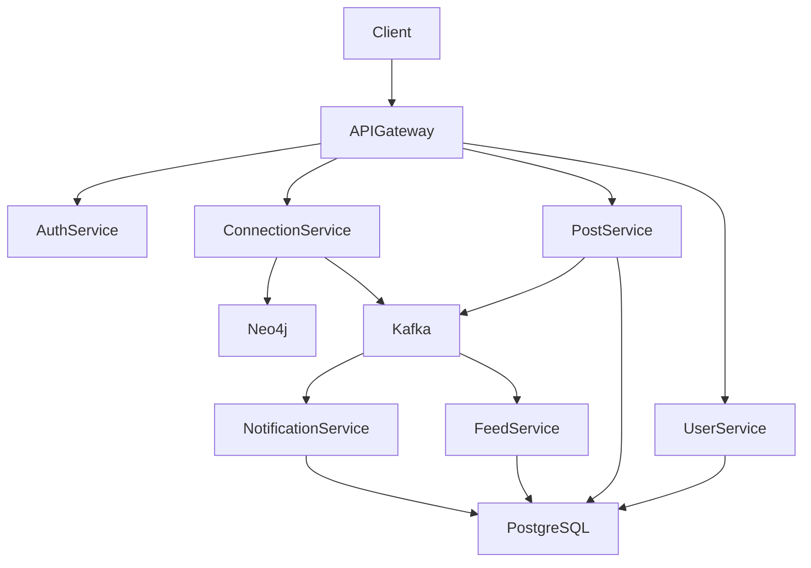
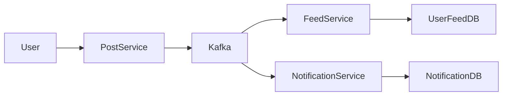

---

# LinkedIn Microservices Backend – Spring Boot

A backend system that simulates the core functionality of a professional networking platform similar to **LinkedIn**.

The system is built using **microservices architecture** with **Spring Boot**, **Apache Kafka**, and **Neo4j** to support scalable social networking operations including professional connections, posts, and personalized feeds.

The project demonstrates how large social platforms structure distributed backend systems to handle millions of interactions efficiently.

---

# Application Overview

The platform supports the following features:

* user registration and authentication
* professional networking connections
* post creation and content sharing
* feed generation for connected users
* asynchronous event processing
* scalable microservice communication

Each major capability is implemented as an **independent microservice**.

---

# Tech Stack

### Backend

* Java
* Spring Boot
* Spring Data JPA
* Spring Security

### Messaging

* Apache Kafka

### Databases

* PostgreSQL
* Neo4j Graph Database

### Authentication

* JWT Token Authentication
* Role Based Authorization

### Tools

* Maven
* Swagger API Documentation

---

# Microservices Architecture

The system follows a **microservices architecture** where each service is responsible for a specific business capability.

Services communicate using:

* **REST APIs** (synchronous communication)
* **Kafka events** (asynchronous communication)

---

# Microservices Architecture Diagram



---

# Core Microservices

## Authentication Service

Handles authentication and authorization.

Responsibilities:

* user signup
* user login
* JWT token generation
* role based access control

Endpoints:

```
POST /signup
POST /login
```

Example authentication header:

```
Authorization: Bearer <JWT_TOKEN>
```

---

## User Service

Responsible for managing user profiles.

Features:

* create user profile
* update profile
* retrieve profile information
* manage professional details

Endpoints:

```
GET /users/{userId}
PUT /users/profile
```

---

## Connection Service

Manages professional network relationships.

This service uses **Neo4j graph database** to efficiently represent and query social connections.

Graph representation:

```
(User)-[:CONNECTED_TO]->(User)
```

Features:

* send connection request
* accept connection request
* list connections
* mutual connections

Endpoints:

```
POST /connections/request
POST /connections/accept
GET /connections/{userId}
```

---

## Post Service

Handles creation and management of user posts.

Features:

* create post
* delete post
* retrieve posts

Endpoints:

```
POST /posts
DELETE /posts/{postId}
GET /posts/{userId}
```

When a post is created, the service publishes a **Kafka event**.

---

## Feed Service

Responsible for generating personalized feeds for users.

Feeds are generated through **event-driven updates** from Kafka.

Example workflow:

```
User creates post → Kafka event → Feed Service updates feeds
```

---

## Notification Service

Responsible for notifying users when important events occur.

Examples:

* connection request received
* new post from a connection
* message received

The service listens to Kafka events.

---

# Event Driven Architecture (Kafka)

The platform uses **Apache Kafka** as the event streaming backbone.

Kafka allows services to communicate asynchronously and remain loosely coupled.

---

# Kafka Event Flow Diagram



Example events published to Kafka:

```
PostCreatedEvent
ConnectionCreatedEvent
MessageSentEvent
```

---

# Database Design

The system uses **polyglot persistence**.

### PostgreSQL

Used for relational data:

```
User
Post
Message
ConnectionRequest
Feed
Notification
```

---

### Neo4j

Used for social graph operations.

Example graph:

```
(User)-[:CONNECTED_TO]->(User)
(User)-[:FOLLOWS]->(User)
```

Neo4j enables efficient queries such as:

* mutual connections
* second degree connections
* network recommendations

---

# Service Communication

Two types of communication exist between services.

### Synchronous Communication

REST API calls.

Example:

```
Feed Service → User Service
```

---

### Asynchronous Communication

Event streaming via Kafka.

Example:

```
Post Service → Kafka → Feed Service
```

---

# Security

Security is implemented using:

* JWT authentication
* role-based authorization
* protected APIs

All endpoints require authentication except login and signup.

---

# Running the Project

Clone the repository:

```
git clone https://github.com/lokesh2yss/LinkedIn-Microservice-Backend
```

Navigate to project directory:

```
cd LinkedIn-Microservice-Backend
```

Start required services:

```
Kafka
PostgreSQL
Neo4j
```

Run services:

```
mvn spring-boot:run
```

---

# Future Improvements

Possible enhancements include:

* distributed feed generation
* Redis caching
* recommendation system
* real-time notifications via WebSockets
* containerization using Docker
* Kubernetes deployment

---

# Author

Lokesh Kumar
Senior Backend Engineer
Java | Spring Boot | Distributed Systems

LeetCode
[https://leetcode.com/u/lokeshtalks/](https://leetcode.com/u/lokeshtalks/)

---

