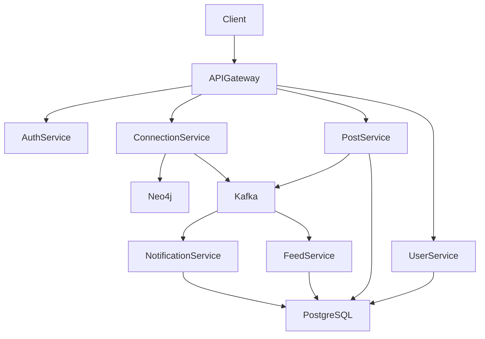
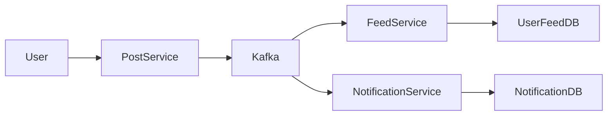

---

# LinkedIn Microservices Backend – Spring Boot

A backend system that simulates the core functionality of a professional networking platform similar to **LinkedIn**.

---

# System Design Summary

This project demonstrates a **distributed microservices architecture** for a professional networking platform.

Key architectural characteristics:

- Microservices implemented using **Spring Boot**
- **Event-driven communication using Apache Kafka**
- **Graph-based connection storage using Neo4j**
- **JWT-based authentication and role-based authorization**
- **Containerized deployment using Docker and Kubernetes**
  
The system separates responsibilities into independent services such as:

* authentication
* user profile management
* professional connections
* post creation
* feed generation
* notifications

Each service can be developed, deployed, and scaled independently.

---

# Application Overview

The platform supports core LinkedIn-style functionality:

* user authentication and profile management
* professional connection graph
* post creation and sharing
* feed generation
* event-driven updates
* notification system

Each business capability is implemented as an independent **microservice**.

---

# Tech Stack

### Backend

* Java
* Spring Boot
* Spring Data JPA
* Spring Security

### Messaging

* Apache Kafka

### Databases

* PostgreSQL
* Neo4j Graph Database

### Authentication

* JWT Token Authentication
* Role Based Authorization

### Infrastructure

* Docker
* Kubernetes

### Tools

* Maven
* Swagger API Documentation

---

# Microservices Architecture

The system follows a **microservices architecture** where each service is responsible for a specific domain capability.

Services communicate using:

* **REST APIs** (synchronous communication)
* **Kafka events** (asynchronous communication)

---

# System Architecture Diagram



---

# Core Microservices

## Authentication Service

Handles authentication and authorization.

Responsibilities:

* user signup
* user login
* JWT token generation
* role-based access control

Endpoints:

```
POST /signup
POST /login
```

Authentication header example:

```
Authorization: Bearer <JWT_TOKEN>
```

---

## User Service

Responsible for managing user profiles.

Features:

* create profile
* update profile
* fetch profile information

Endpoints:

```
GET /users/{userId}
PUT /users/profile
```

---

## Connection Service

Manages professional network relationships.

Uses **Neo4j graph database** to efficiently represent and query connections.

Graph representation:

```
(User)-[:CONNECTED_TO]->(User)
```

Features:

* send connection request
* accept connection request
* view connections
* mutual connections

Endpoints:

```
POST /connections/request
POST /connections/accept
GET /connections/{userId}
```

---

## Post Service

Handles content creation.

Features:

* create post
* delete post
* retrieve posts

Endpoints:

```
POST /posts
DELETE /posts/{postId}
GET /posts/{userId}
```

When a post is created, the service publishes an **event to Kafka**.

---

## Feed Service

Responsible for generating personalized feeds.

Feeds are updated using **Kafka event streams**.

Example workflow:

```
User creates post
       |
Post Service publishes event
       |
Kafka Topic
       |
Feed Service consumes event
       |
User feed updated
```

---

## Notification Service

Responsible for generating notifications.

Examples:

* connection request received
* new post from connection
* message received

This service subscribes to Kafka topics.

---

# Event Driven Architecture (Kafka)

The platform uses **Apache Kafka** as the event streaming backbone.

Kafka enables asynchronous communication between microservices.

---

# Kafka Event Flow Diagram



Example events:

```
PostCreatedEvent
ConnectionCreatedEvent
MessageSentEvent
```

---

# Database Design

The system uses **polyglot persistence**.

### PostgreSQL

Used for relational data:

```
User
Post
Message
Feed
Notification
```

---

### Neo4j

Used for graph-based connection queries.

Example graph:

```
(User)-[:CONNECTED_TO]->(User)
(User)-[:FOLLOWS]->(User)
```

Neo4j enables:

* mutual connections
* second-degree connections
* network recommendations

---

# Service Communication

### Synchronous

REST API calls.

Example:

```
Feed Service → User Service
```

---

### Asynchronous

Kafka event streaming.

Example:

```
Post Service → Kafka → Feed Service
```

---

# Security

Security features include:

* JWT authentication
* role-based authorization
* protected APIs

All endpoints require authentication except login and signup.

---

# Kubernetes Deployment

The repository includes a **`k8s/` directory** containing Kubernetes configuration files used to deploy the microservices.

These manifests define:

* Deployments
* Services
* Container configurations

Deployment workflow:

```
Build Docker images
        |
Push images to container registry
        |
Apply Kubernetes manifests
        |
kubectl apply -f k8s/
```

Example command:

```
kubectl apply -f k8s/
```

This deploys the microservices into a Kubernetes cluster.

---

# Running the Project Locally

Clone the repository:

```
git clone https://github.com/lokesh2yss/LinkedIn-Microservice-Backend
```

Navigate to project directory:

```
cd LinkedIn-Microservice-Backend
```

Start required services:

```
Kafka
PostgreSQL
Neo4j
```

Run services:

```
mvn spring-boot:run
```

---

# Future Improvements

Potential enhancements include:

* Redis caching for feeds
* recommendation engine
* real-time notifications using WebSockets
* advanced Kubernetes auto-scaling
* service mesh integration

---

# Author

Lokesh Kumar

Senior Backend Engineer
Java | Spring Boot | Distributed Systems

LeetCode
[https://leetcode.com/u/lokeshtalks/](https://leetcode.com/u/lokeshtalks/)

---

